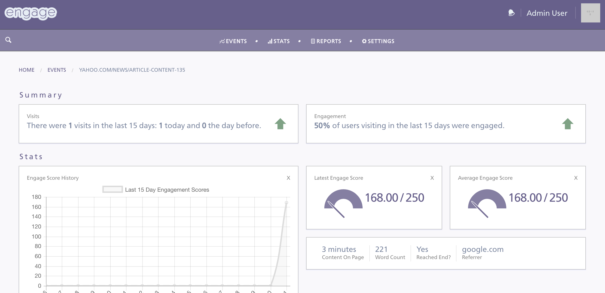

<h1 align="center">Engagement<br></h1>
<h4 align="center">Metrics and Analytics</h4>

<p align="center">
  <a href="https://circleci.com/gh/nicksoto/engagement-backend"></a>
</p>
<br>

This is the home for the Engagement backend. Please note, this is an <b>Experimental</b> project that utilizes Influxdb as a Time-Series DB for the backend as well as a JS Client that utitlizes new HTML API's with fractured support across browsers.

### Background

There are currently few tools that measure how engaged a user is when viewing online content. This project seeks to take metrics that correlate w/ user engagement (time content is within viewport, page visibility, scroll depth, etc) and use these as predictor variables of positive user engagement.

### Application Features

<h1 align="center">
  <br>
  <a>
    
  </a>
  <br>
</h1>

- See latest page visits
- Top 10 pages by Engage score, visit, and referral
- Historical view of page visits grouped by Engage scores
- and more

### Todo

- Flynn/Docker Deployment steps
- Better UI Interface

### Dependencies & Setup

##### Dependencies

```unix
  brew install pg
  brew install redis
  brew install influxdb
  brew install node
  brew install go

  powder link api.engage
  touch .powenv
  rvm env -- 2.2.3@engagement > .powenv

  export GOPATH=/path_to_go
  go get github.com/benmanns/goworker
  go get github.com/xlvector/hector
  go get github.com/xlvector/hector/hectorcv

```

don't use rails server for local development, use:

```unix
  npm run postinstall (if first install or devdependencies change)
  npm run rails-server
```

this uses webpack to rebuild the app/assets/web-bundle.js file w/ react components.

react is a dependency so get [react developer tools for chrome](https://chrome.google.com/webstore/detail/react-developer-tools/fmkadmapgofadopljbjfkapdkoienihi/related). More information on goworker dependencies and influxdb can be found at the following links:

- goworkers: http://mildlyinternet.com/code/supercharge-resque-and-sidekiq-with-go-part-2.html
- influxdb: https://www.influxdata.com/time-series-platform/influxdb/

##### Setup

```ruby
  rake db:create
  rake db:migrate:with_data
  rake db:seed
```

##### Debugging

```unix
  powder restart
  add `byebug` to line in code
  bundle exec byebug -R localhost:1048
  hit api endpoint with `byebug` line
```

##### Deploying

Docker and Docker Compose scripts are available

```unix
  brew install docker-compose
  brew install docker-machine
  brew install Caskroom/cask/virtualbox
```

Alternatively you can use Flynn for deployments

`brew install flynn`
`flynn install`
`flynn -a dashboard env | grep LOGIN_TOKEN # for accessing login token`

```unix
  powder restart
  add `byebug` to line in code
  bundle exec byebug -R localhost:1048
  hit api endpoint with `byebug` line
```


### License

Copyright (c) [Nick Soto](http://google.com)
